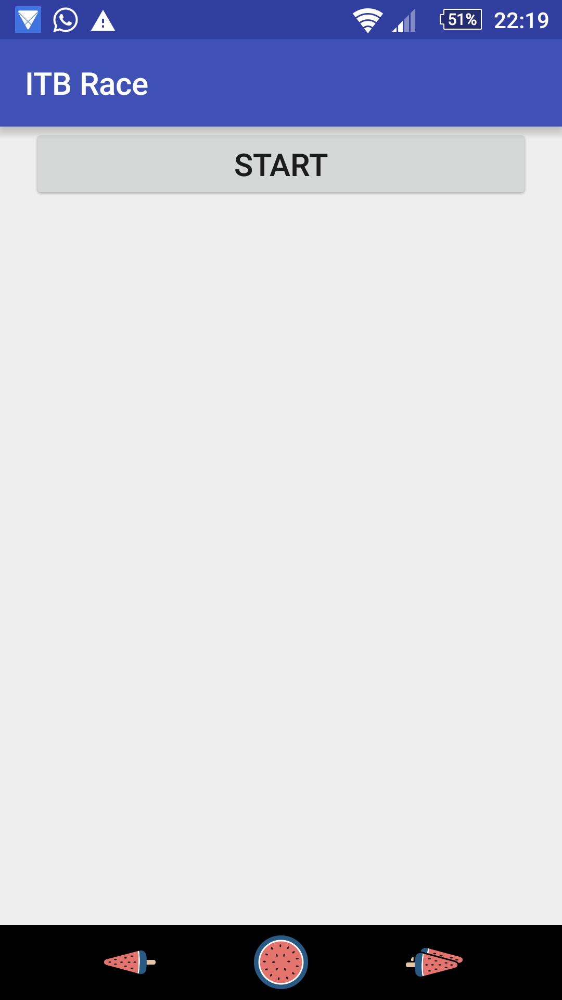
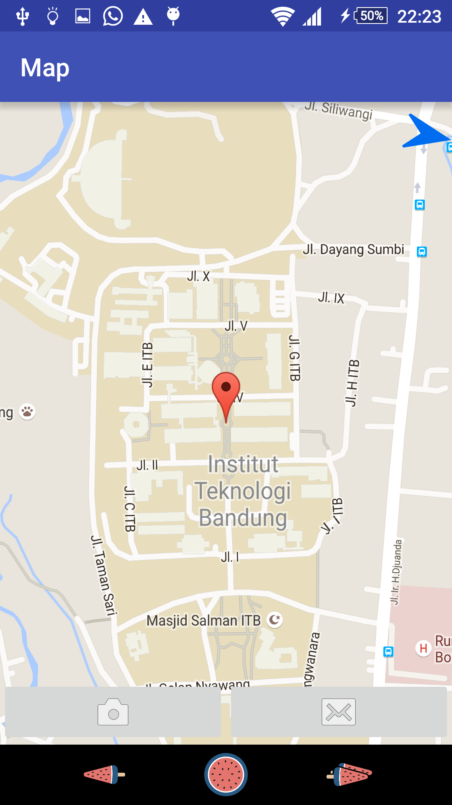
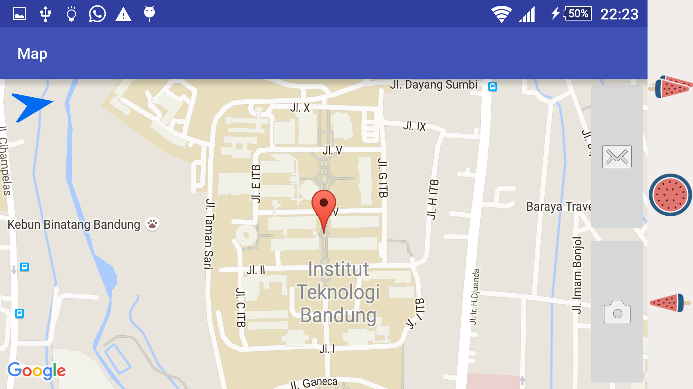
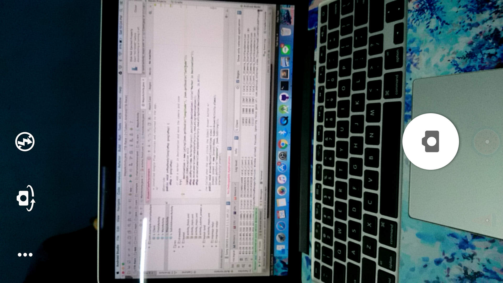
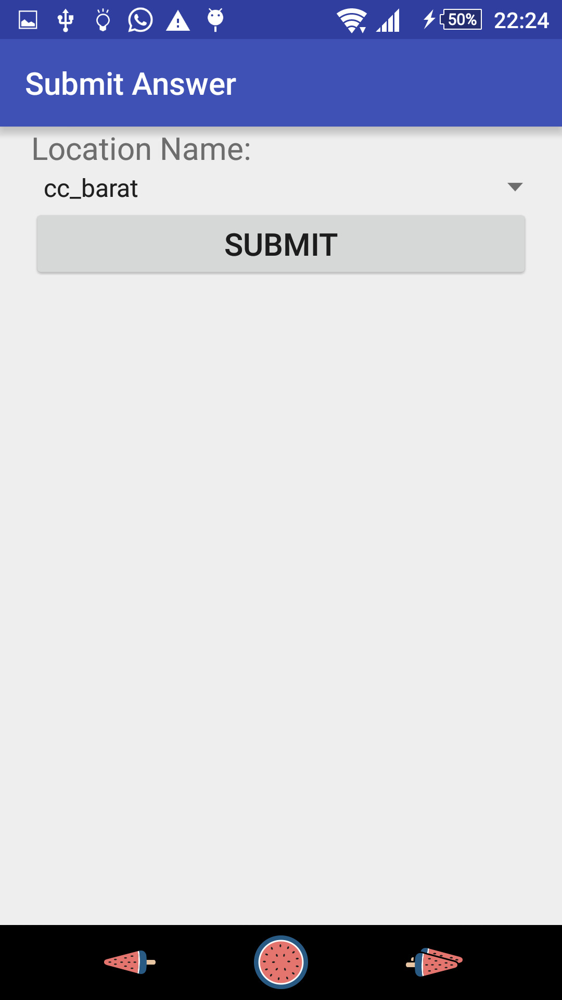
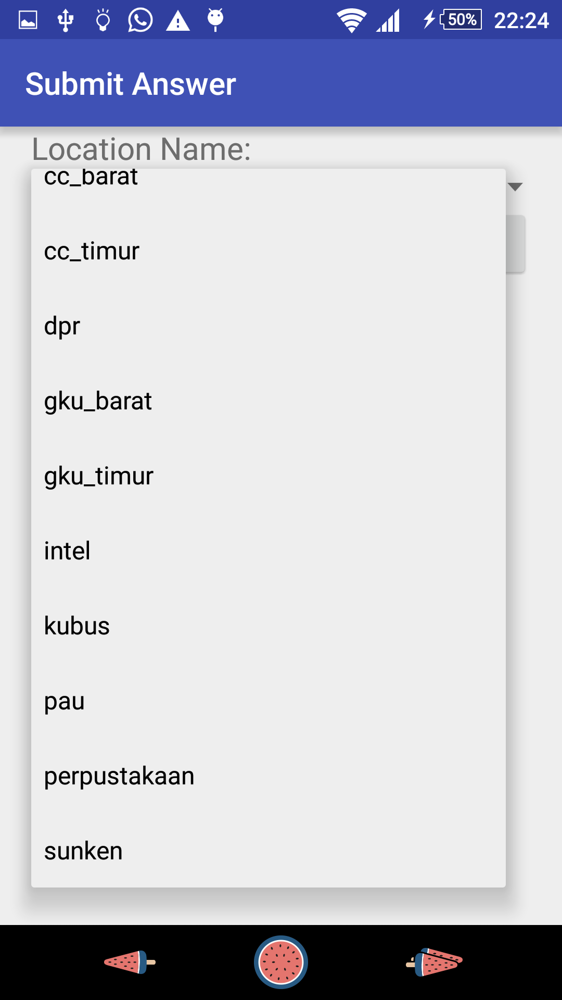
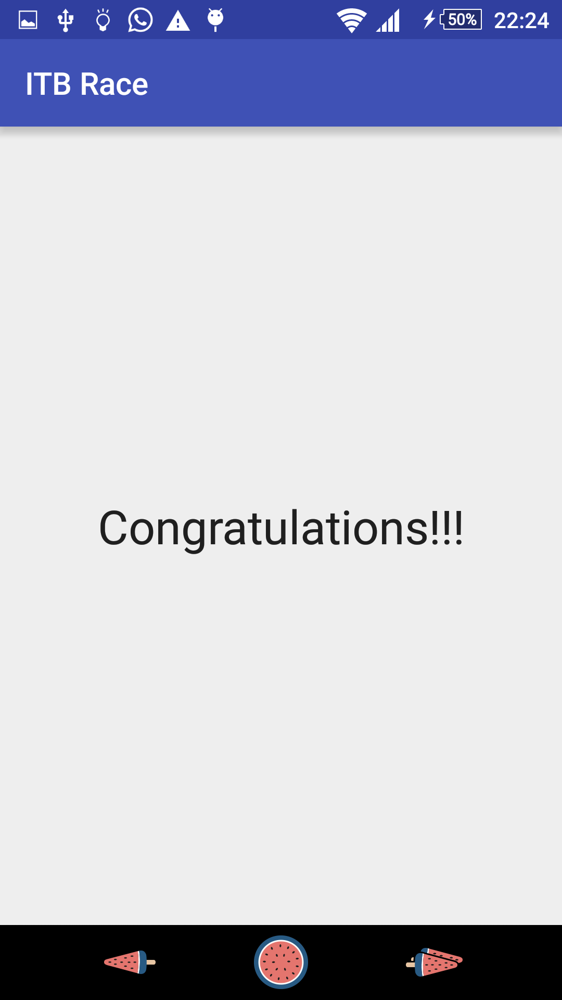

# Tugas Besar 1 IF3111 Pengembangan Aplikasi pada Platform Khusus

## Garis Besar Aplikasi

Aplikasi yang dibuat adalah aplikasi Android yang dapat digunakan untuk permainan mencari lokasi. Aplikasi ini akan membantu peserta permainan menemukan lokasi tujuan dengan menampilkan peta (Google Maps) dan arah tujuannya. Server permainan akan memberikan tiga buah lokasi yang harus ditemukan oleh peserta. Pada setiap lokasi, peserta akan diminta untuk foto-diri di lokasinya serta mengirimkan nama lokasi tempat peserta berada.

Daftar kemungkinan jawaban lokasi sudah ditentukan sebagai berikut.

* gku_barat
* gku_timur
* intel
* cc_barat
* cc_timur
* dpr
* sunken
* perpustakaan
* pau
* kubus

## Skenario Aplikasi

Skenario dari aplikasi yang dibangun sebagai berikut

* Pengguna akan disambut dengan halaman utama sebagai berikut.

* Pengguna akan klik tombol "START", kemudian aplikasi akan request location pertama ke server.

* Pengguna akan masuk ke halaman peta. Akan terdapat pin indikator lokasi tujuan, pin indikator lokasi sekarang, dan kompas yang menghadap arah utara. Berikut tampilannya pada mode potrait.

* Berikut tampilan pada mode landscape.

* Pengguna dapat berjalan menuju lokasi. Ketika pengguna sampai, pengguna dapat menggunakan fitur foto-diri untuk foto dirinya di lokasi dengan klik tombol dengan ikon kamera. Berikut tampilan fitur foto-diri.

* Setelah foto diri, pengguna dapat mengirimkan jawaban lokasinya menggunakan fitur submit answer. Berikut tampilan fitur submit answer.

* Pengguna dapat memilih salah satu pilihan jawaban dari drop down list yang ada, kemudian klik tombol submit untuk menjawab sebagai berikut.

* Jika jawaban benar, pengguna akan kembali ke peta untuk melanjutkan pencarian lokasi. Server akan mengirimkan lokasi baru untuk dicari. Sementara, jika jawaban salah, pengguna juga akan kembali ke peta namun tetap menggunakan lokasinya yang lama.

* Hal ini akan berulang sampai pengguna berhasil menemukan tiga buah lokasi benar, ini ditandai dengan pesan finish dari server. Kemudian, pengguna akan masuk ke halaman finish yang akan menampilkan pesan selamat. Berikut tampilannya.

## Lokasi Source Code dan Binary
Source Code: ITB-Race
Binary: ITB-Race/app/build/outputs/apk/app-debug.apk